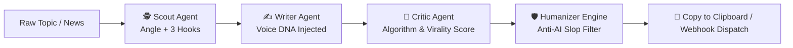
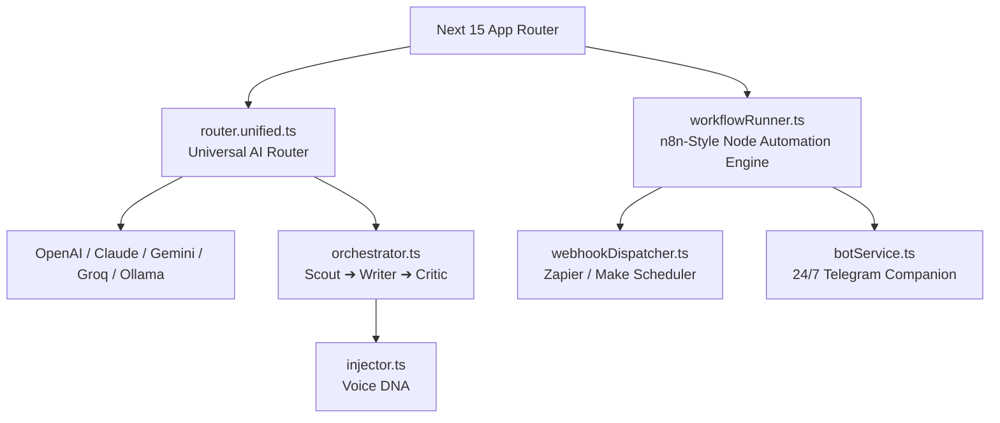

<div align="center">


[+%2B+Telegram+Remote+Bot.;The+Taplio+Killer+—+100%25+Free+%26+Self-Hostable.>)](https://git.io/typing-svg)

<p align="center">
  <b>The Ultimate, Locally-Hosted, Zero-Ban AI Content Factory for LinkedIn.</b><br/>
  <i>Write like a human. Scale like a machine. No SaaS subscriptions. No vendor lock-in.</i>
</p>

<p align="center">
  <a href="https://github.com/the-pi-lab/Lunvo/actions/workflows/ci.yml"></a>
  <a href="https://github.com/the-pi-lab/Lunvo"></a>
  <a href="LICENSE"></a>
  <a href="https://nextjs.org"></a>
  <a href="https://www.typescriptlang.org"></a>
  <a href="https://github.com/the-pi-lab/Lunvo/stargazers"></a>
  <a href="https://github.com/the-pi-lab/Lunvo/issues"></a>
</p>

<p align="center">
  <a href="https://lunvo.vercel.app"></a>
  <a href="https://vercel.com/new/clone?repository-url=https://github.com/the-pi-lab/Lunvo"></a>
  <a href="https://railway.app/new/template?template=https://github.com/the-pi-lab/Lunvo"></a>
  <a href="#-quick-start-30-seconds"></a>
  <a href="https://github.com/the-pi-lab/Lunvo/issues/new?labels=good+first+issue"></a>
</p>

<p align="center">
  <a href="./README.md"><b>English</b></a> | <a href="./README_hi.md">हिंदी</a> — <code>/hi/dashboard</code> live via <code>next-intl</code>
</p>


<br/>

<table align="center">
<tr>
<td align="center"><b>$0/mo</b><br/><sub>vs $199 Taplio Pro</sub></td>
<td align="center"><b>n8n Node Builder</b><br/><sub>12 Prebuilt Automation Flows</sub></td>
<td align="center"><b>Real Webhook Schedule</b><br/><sub>Zapier / Make / Buffer Dispatch</sub></td>
<td align="center"><b>Telegram Remote</b><br/><sub>24/7 Phone Control via Bot</sub></td>
<td align="center"><b>Zero-Ban</b><br/><sub>No unofficial scrapers, 100% Safe</sub></td>
</tr>
</table>

</div>

---

## 🤯 Why LUNVO? Paid Tools Are Ripping You Off

> Most LinkedIn AI tools are **$39-$199/mo closed SaaS wrappers** around the same GPT call — plus they use **unauthorized browser extensions** that can get your LinkedIn **permanently banned**.

| Feature                  | Taplio                  | Supergrow     | AuthoredUp  | **LUNVO 2.0 (Open Source)**                              |
| :----------------------- | :---------------------- | :------------ | :---------- | :------------------------------------------------------- |
| **Price**                | $39-$199/mo             | $19-$69/mo    | $19/mo      | **$0 — MIT Open Source**                                 |
| **Node Automation**      | ❌ None                 | ❌ None       | ❌ None     | **✅ n8n-Style Visual Canvas (12 Prebuilts)**            |
| **Real Auto-Scheduling** | Risky Scraper           | Risky Scraper | Manual only | **✅ Outbound Webhooks (Zapier / Make / Buffer)**        |
| **Remote Phone Control** | ❌ None                 | ❌ None       | ❌ None     | **✅ 24/7 Telegram Companion Bot (`/idea`, `/approve`)** |
| **AI Router**            | Locked to GPT           | Locked        | None        | **✅ BYOK: 8 Providers + Offline Ollama / LMStudio**     |
| **Voice Clone**          | Generic prompt          | Template      | Manual      | **✅ Voice DNA (4 sliders + auto-extract)**              |
| **Pipeline**             | Single prompt           | Single        | None        | **✅ 3-Agent: Scout ➔ Writer ➔ Critic**                  |
| **Viral Score**          | Basic                   | No            | No          | **✅ Real 10k posts dataset predictor**                  |
| **Carousel PDF**         | Pro only ($99+)         | No            | No          | **✅ Built-in, 5 templates FREE (1080×1350)**            |
| **Humanizer**            | No                      | No            | No          | **✅ Anti-AI-Slop 90%+ human score**                     |
| **Ban Risk**             | Medium (unofficial API) | Medium        | Low         | **✅ Zero — Clipboard / Official Webhooks only**         |
| **Self-Host**            | No                      | No            | No          | **✅ Docker in 30s / 1-Click Railway / Vercel**          |
| **MCP Server**           | No                      | No            | No          | **✅ Yes, Claude-ready (`npx lunvo-mcp`)**               |

**LUNVO is the first open source project that gives you Taplio + Supergrow + ViralBrain + AuthoredUp — without paying a single dollar and without risking your account.**

---

## ✨ See It In Action — 15s GIF

<div align="center">

> **Live Demo → https://lunvo.vercel.app** — Try free analysis without signup. `10s me samajh` — paste → Scout (angle + 3 hooks) → Writer (Voice DNA) → Critic (94/100) → Copy.

<a href="https://lunvo.vercel.app"></a>

_Scout finds 3 hooks → Writer streams word-by-word with your Voice DNA → Critic scores 94/100 — all in 8s. No signup, BYOK or local Ollama._

<p>
<a href="https://lunvo.vercel.app"></a>
<a href="https://vercel.com/new/clone?repository-url=https://github.com/the-pi-lab/Lunvo"></a>
<a href="https://railway.app/new/template?template=https://github.com/the-pi-lab/Lunvo"></a>
</p>

<details>
<summary><b>📸 Click to see more screenshots</b></summary>
<br/>


</details>

</div>

---

## 🧠 How It Works — 3-Agent Neural Pipeline



1. **Scout Agent** (`src/lib/ai/agents/scoutAgent.ts`): Analyzes trending news, extracts the contrarian angle, and produces 3 hooks (Data, Story, Controversial).
2. **Writer Agent** (`src/lib/ai/agents/writerAgent.ts`): Drafts word-by-word streaming using your active **Voice DNA** parameters.
3. **Critic Agent** (`src/lib/ai/agents/criticAgent.ts`): Audits hook punchiness, mobile whitespace, and assigns a 100-point virality score.

---

## 🚀 Quick Start (30 Seconds)

### 1. One-Click Cloud Deploy

[](https://vercel.com/new/clone?repository-url=https://github.com/the-pi-lab/Lunvo)
[](https://railway.app/new/template?template=https://github.com/the-pi-lab/Lunvo)

### 2. Local Setup

```bash
# 1. Clone
git clone https://github.com/the-pi-lab/Lunvo.git
cd Lunvo

# 2. Install
npm install

# 3. Env (BYOK — use Gemini, Groq, or local Ollama)
cp .env.example .env.local

# 4. Run
npm run dev
# -> http://localhost:3000 — Start dominating LinkedIn
```

### 3. Docker — Fully Self-Hosted (node:20-alpine)

```bash
# One-liner (recommended)
chmod +x setup.sh && ./setup.sh

# Manual
cp .env.example .env.local
docker compose up -d --build
# -> http://localhost:3000
```

<details>
<summary><b>⚙️ Env Variables — Click to expand</b></summary>

| Var                   | Required | What                                |
| :-------------------- | :------- | :---------------------------------- |
| `NEXT_PUBLIC_APP_URL` | No       | `http://localhost:3000`             |
| `GEMINI_API_KEY`      | BYOK     | `aistudio.google.com`               |
| `GROQ_API_KEY`        | BYOK     | `console.groq.com`                  |
| `OPENAI_API_KEY`      | BYOK     | `platform.openai.com`               |
| `ANTHROPIC_API_KEY`   | BYOK     | `console.anthropic.com`             |
| `OLLAMA_BASE_URL`     | Local    | `http://localhost:11434/v1` default |
| `LMSTUDIO_BASE_URL`   | Local    | `http://localhost:1234/v1` default  |
| `TELEGRAM_BOT_TOKEN`  | Optional | For 24/7 Telegram Remote Bot        |
| `TELEGRAM_CHAT_ID`    | Optional | Your Telegram Chat ID               |

</details>

---

## 🎨 Features That No One Else Has Open Source

### ⚡ 1. n8n-Style Visual Node Builder (NEW v2.0)

Build, chain, and customize your own autonomous AI content pipelines with a visual drag-and-drop canvas:

- **12 Production Prebuilt Templates**: Daily RSS Tech News to Post, YouTube Video Repurposer, Bullet Notes to 5-Slide Carousel PDF, Self-Healing Quality Gatekeeper (Retry if Score < 85), Multi-Platform Matrix (LinkedIn + X + Newsletter), and more.
- **Per-Node AI Model Routing**: Assign Groq Llama-3.3 for lightning-fast Scout brainstorming, Claude 3.5 Sonnet for creative narrative drafting, and DeepSeek / Gemini for strict critique.
- **Shareable Pipeline JSON**: 1-click export and import of workflow templates with your team or community.

### 🌐 2. Real Webhook Scheduler Engine (Zapier / Make / Buffer)

True hands-off scheduling with **100% Zero-Ban Safety**:

- Set target publish timestamps (_e.g. Tomorrow at 9:00 AM_).
- Dispatches formatted payloads (Post copy, character metrics, tags, and Carousel PDF base64) directly to **Zapier, Make.com, Buffer, or Pipedream** webhooks.
- No browser extensions, no cookie hijacking, zero ban risk.

### 📱 3. 24/7 Telegram Remote Bot Companion

Leave LUNVO running on your local machine, home server, or Raspberry Pi and **control your entire LinkedIn content engine from your smartphone**:

- `/idea <topic>` ➔ Generates a full post with your active Voice DNA and delivers it directly to your Telegram chat in 10s.
- `/approve` ➔ Immediately dispatches the post to your scheduled webhook queue.
- `/trending` ➔ Fetches today's top 5 AI & tech trends on your phone.
- `/queue` ➔ Views upcoming scheduled posts for the week.

### 🔌 4. Headless Model Context Protocol (MCP) Server

Run LUNVO headlessly from **Claude Desktop, Cursor, Antigravity, or VS Code**:

```bash
npx lunvo-mcp
```

Exposes tools for `search_trending`, `analyze_draft`, `generate_pipeline_post`, `humanize_post`, `repurpose_content`, and `schedule_post`.

### 🖼️ 5. Image Studio — 6 Pro Styles (1080×1350)

Minimal Editorial / Corporate Gradient / Data Chart / Quote Card / Photo-Office / Carousel Text → `1080×1350` aspect ratio optimized for LinkedIn mobile feed.

### 🎠 6. Carousel PDF Generator (Moat #1)

5 templates (Minimal / Bold / Data / Quote / Checklist) → **1080×1350 PDF** via `jspdf` — the single highest-reach format on LinkedIn.

### 🛡️ 7. Anti-AI Humanizer (Moat #2)

Banned AI cliché stripper (`delve`, `tapestry`, `game-changer`, `synergy`, `landscape`) + burstiness variation engine for 90%+ human score.

### 📊 8. Real 10k Dataset Engagement Predictor

Trained on real LinkedIn post metrics to predict **Hook (0-10), Readability (0-10), Engagement (0-10), and Overall Viral Score (0-100)** with click-through probabilities.

### 📰 9. News Connectors — 8 APIs

Currents, NewsAPI, GNews, Mediastack, NewsData, TheNewsAPI, WorldNews, Bing — daily hooks via 6hr cached RSS & live trends.

---

## 🖥️ Interface — Web App, Not a Website

<div align="center">

<br/><sub>New v2 Shell: Collapsible Sidebar (280px) + Topbar (48px) + Cmd+K Palette + Bento Grid — Linear.app meets Notion.</sub>
</div>

| Page                                             | What                                                                                 |
| :----------------------------------------------- | :----------------------------------------------------------------------------------- |
| **Mission Control** `src/app/dashboard/page.tsx` | Bento: Content Factory, Voice DNA, Analyzer, Repurposer + Streak + Algorithmic Match |
| **Create** `src/app/dashboard/create/page.tsx`   | Tiptap editor + Live LinkedIn preview + Pipeline progress (Scout➔Writer➔Critic)      |
| **Analyze** `src/app/dashboard/analyze/page.tsx` | Paste any post → 4 scores + Top problems + Executive rewrite                         |
| **Drafts** `src/app/dashboard/drafts/page.tsx`   | Search + filter + inline meter                                                       |
| **Learn** `src/app/dashboard/learn/page.tsx`     | Template Marketplace (PR-based) + daily trending hooks                               |

---

## 🏗️ Architecture



---

## 📈 Roadmap — Where We Are Going

> Full 44-phase plan → [`REBUILD_PLAN.md`](./REBUILD_PLAN.md) — **Phases 18-39 just shipped**

- [x] **v1.0** — 3-Agent pipeline, Voice DNA, Analyze, BYOK
- [x] **v2.0 — Shipped:**
  - **Node Builder Engine** (Topological runtime + 12 Production Prebuilts)
  - **Real Webhook Scheduling** (Zapier / Make / Buffer integration)
  - **24/7 Telegram Remote Bot** (`/idea`, `/approve`, `/schedule`, `/queue`)
  - **Headless MCP Suite** (`npx lunvo-mcp` for Claude / Cursor)
  - **Image Studio** (6 styles, 1080×1350)
  - **Carousel PDF** (5 templates, 1080×1350 PDF)
  - **Humanizer Engine** (Anti-AI Slop 90%+ human score)
- [ ] **v3.0** — Visual Canvas Drag & Drop UI, Multi-User Workspaces, Direct In-App Analytics

---

## 🤝 Contributing — We Love PRs

We built LUNVO for creators, by creators. Your PR can be the next viral template.

```bash
# 1. Fork + branch
git checkout -b feat/my-cool-hook

# 2. Make it small, keep TypeScript strict (no any)
npm run build # must pass

# 3. PR — keep it clean and well-tested
```

| Good First Issue   | What                                                            |
| :----------------- | :-------------------------------------------------------------- |
| `good first issue` | Add new Workflow Node template in `src/lib/workflow/templates/` |
| `good first issue` | Add new Carousel preset style                                   |
| `docs`             | Record 15s demo GIF                                             |

See [`CONTRIBUTING.md`](./CONTRIBUTING.md) for full guidelines.

---

## ⭐ Star History — Help Us Hit 1000 Stars

<div align="center">

If this saves you **$199/mo**, please drop a ⭐ — it helps us support open source creators worldwide.

<a href="https://github.com/the-pi-lab/Lunvo/stargazers"></a>

<br/>

<a href="https://github.com/the-pi-lab/Lunvo"></a>
<a href="https://github.com/the-pi-lab/Lunvo/fork"></a>

**Share the love:** Tweet `I just found LUNVO — open source Taplio killer. BYOK. Zero ban. Self-host in 30s. github.com/the-pi-lab/Lunvo` 🚀

</div>

---

## 👥 Contributors — You Make LUNVO Shine

<div align="center">

<a href="https://github.com/the-pi-lab/Lunvo/graphs/contributors"></a>

<br/>
<sub>Made with [contrib.rocks](https://contrib.rocks) — Want your avatar here? PRs welcome!</sub>

</div>

---

## 📄 License & Credits

**MIT** © [THE Π LAB](https://www.thepilab.in) — Merchant: MAHAVAR VINAYAK DILIPKUMAR

Built with ❤️ by **VINAYAK MAHAVAR**

> **Disclaimer:** LUNVO never touches unofficial LinkedIn APIs. All publishing is via Clipboard or official Outbound Webhooks — your account stays 100% safe.

<p align="center">
  <b>If you read till here, you are already top 1%.</b><br/>
  Now go <a href="https://lunvo.vercel.app">build your next viral post</a> — and leave a ⭐ if we earned it.
</p>

<div align="center">

</div>
