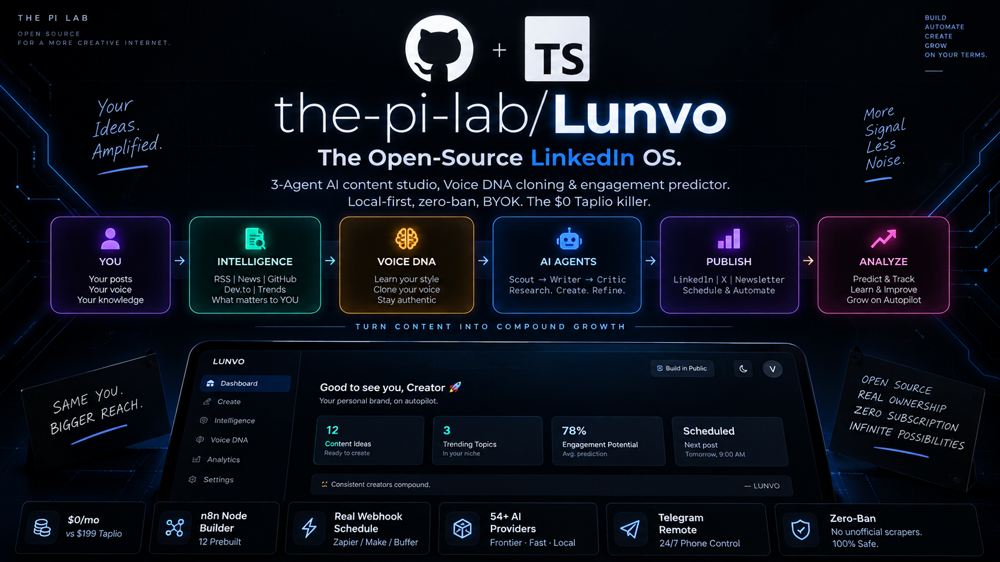
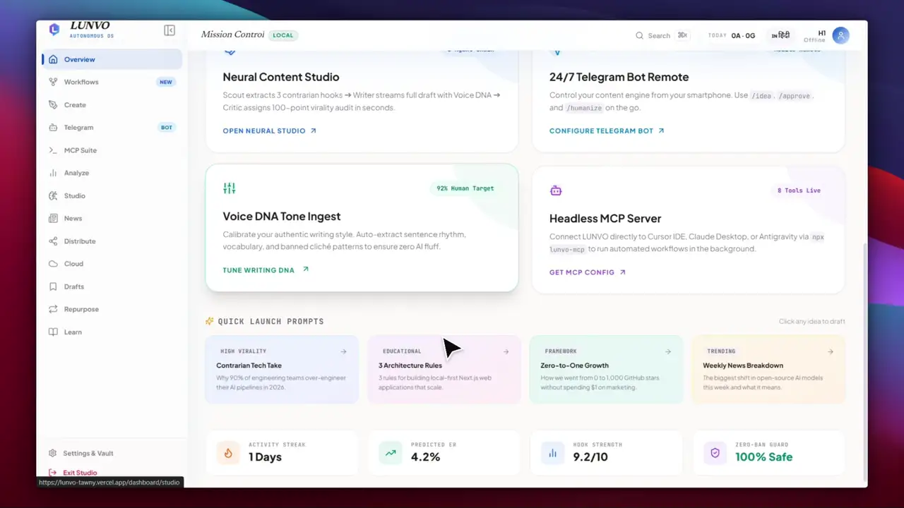
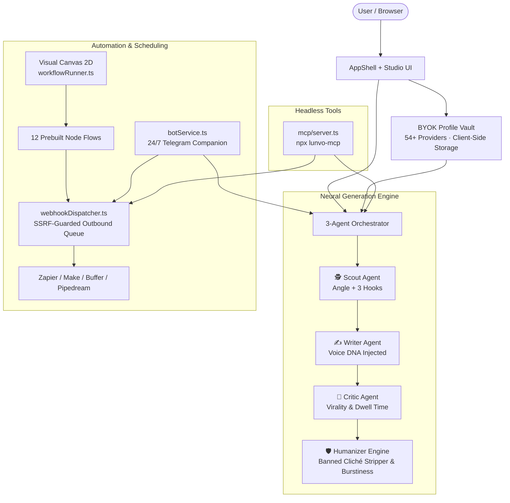

<div align="center">


[+%2B+Telegram+Remote+Bot.;54%2B+AI+Providers+Universal+Registry+%2B+BYOK+Vault.;The+Taplio+Killer+—+100%25+Free+%26+Self-Hostable.>)](https://git.io/typing-svg)

<p align="center">
  <b>The Ultimate, Locally-Hosted, Zero-Ban AI Content Operating System for LinkedIn.</b><br/>
  <i>Write like a human. Scale like a machine. No SaaS subscriptions. No vendor lock-in.</i>
</p>

<p align="center">
  <a href="https://github.com/the-pi-lab/Lunvo/actions/workflows/ci.yml"></a>
  <a href="https://github.com/the-pi-lab/Lunvo"></a>
  <a href="LICENSE"></a>
  <a href="https://nextjs.org"></a>
  <a href="https://www.typescriptlang.org"></a>
  <a href="https://www.linkedin.com/company/the-%CF%80-lab/"></a>
  <a href="https://github.com/the-pi-lab/Lunvo/stargazers"></a>
</p>

<p align="center">
  <a href="https://lunvo-tawny.vercel.app/"></a>
  <a href="https://vercel.com/new/clone?repository-url=https://github.com/the-pi-lab/Lunvo"></a>
  <a href="https://railway.app/new/template?template=https://github.com/the-pi-lab/Lunvo"></a>
  <a href="#-quick-start-30-seconds"></a>
  <a href="https://www.linkedin.com/company/the-%CF%80-lab/"></a>
</p>

<p align="center">
  <a href="./README.md"><b>English</b></a> | <a href="./README_hi.md">हिंदी</a> — <code>/hi/dashboard</code> live via <code>next-intl</code>
</p>

<a href="https://lunvo-tawny.vercel.app/"></a>

<br/>

<table align="center">
<tr>
<td align="center"><b>$0/mo</b><br/><sub>vs $199 Taplio Pro</sub></td>
<td align="center"><b>n8n Node Builder</b><br/><sub>12 Prebuilt Automation Flows</sub></td>
<td align="center"><b>Real Webhook Schedule</b><br/><sub>Zapier / Make / Buffer Dispatch</sub></td>
<td align="center"><b>54+ AI Providers</b><br/><sub>Frontier · Fast · Local Ollama</sub></td>
<td align="center"><b>Telegram Remote</b><br/><sub>24/7 Phone Control via Bot</sub></td>
<td align="center"><b>Zero-Ban</b><br/><sub>No unofficial scrapers, 100% Safe</sub></td>
</tr>
</table>

</div>

---

## 🏢 Official Company & Project Backing

LUNVO is designed, built, and open-sourced by **[THE Π LAB (The Pi Lab)](https://www.thepilab.in)**.

- **Company LinkedIn:** [THE Π LAB on LinkedIn](https://www.linkedin.com/company/the-%CF%80-lab/)
- **Live Production URL:** [https://lunvo-tawny.vercel.app/](https://lunvo-tawny.vercel.app/)
- **Official Website:** [https://www.thepilab.in](https://www.thepilab.in)
- **Email Contact:** `hello@thepilab.in`

---

## 🤯 Why LUNVO? Paid Tools Are Ripping You Off

> Most LinkedIn AI tools are **$39-$199/mo closed SaaS wrappers** around a single GPT-3.5/4 prompt — plus they use **unauthorized browser extensions** that can get your LinkedIn account **permanently restricted or banned**.

| Feature                   | Taplio                  | Supergrow       | AuthoredUp  | **LUNVO 2.0 (Open Source)**                                           |
| :------------------------ | :---------------------- | :-------------- | :---------- | :-------------------------------------------------------------------- |
| **Price**                 | $39-$199/mo             | $19-$69/mo      | $19/mo      | **$0 — MIT Open Source**                                              |
| **Node Automation**       | ❌ None                 | ❌ None         | ❌ None     | **✅ n8n-Style 2D Visual Canvas (12 Prebuilts)**                      |
| **Real Auto-Scheduling**  | Risky Scraper           | Risky Scraper   | Manual only | **✅ Outbound Webhooks (Zapier / Make / Buffer / Pipedream)**         |
| **Remote Phone Control**  | ❌ None                 | ❌ None         | ❌ None     | **✅ 24/7 Telegram Companion Bot (`/idea`, `/approve`, `/schedule`)** |
| **AI Provider Choice**    | Locked to OpenAI        | Locked          | None        | **✅ 54+ Providers: Claude, Gemini, DeepSeek, Groq, Mistral, Ollama** |
| **Voice Cloning**         | Generic prompt          | Static template | Manual      | **✅ Voice DNA (4 sliders + auto-extract from past posts)**           |
| **Autonomous Pipeline**   | Single prompt           | Single prompt   | None        | **✅ 3-Agent Neural Pipeline: Scout ➔ Writer ➔ Critic**               |
| **Viral Score Predictor** | Subjective / Basic      | No              | No          | **✅ Data-Backed Analytics Predictor (Trained on Real Posts)**        |
| **Carousel PDF Studio**   | Pro only ($99+)         | No              | No          | **✅ 5 Executive Templates, 1080×1350 High-Reach PDF Export**         |
| **Anti-AI Humanizer**     | No                      | No              | No          | **✅ Banned Cliché Stripper + Burstiness Variation (90%+ Human)**     |
| **Omni Repurposer**       | No                      | No              | Basic       | **✅ 1-Click: Post or YouTube Transcript ➔ Thread + Newsletter**      |
| **AI Image Studio**       | Basic / DALL-E only     | No              | No          | **✅ 6 Pro Styles + Pollinations Neural Visuals + Canvas Cards**      |
| **Ban Risk**              | Medium (unofficial API) | Medium          | Low         | **✅ Zero — Official Webhooks & Native System Clipboard Only**        |
| **Self-Hostable**         | No                      | No              | No          | **✅ 1-Click Vercel / Railway / Docker in 30 seconds**                |
| **IDE MCP Server**        | No                      | No              | No          | **✅ Yes, Claude Desktop & Cursor ready (`npx lunvo-mcp`)**           |

**LUNVO gives you the power of Taplio + Supergrow + ViralBrain + AuthoredUp — completely free, private, and account-safe.**

---

## 🎥 Live Interactive Walkthrough & Workflow Engine Demo

<div align="center">

> **Live Web Preview → [https://lunvo-tawny.vercel.app/](https://lunvo-tawny.vercel.app/)**
> _Watch LUNVO 2.0 execute the Autonomous 3-Agent Neural Pipeline and n8n-Style Workflow Canvas live in action._

<a href="https://github.com/the-pi-lab/Lunvo/blob/main/public/videos/lunvo-demo-tour.mp4">
  
</a>

<br/><br/>

<p align="center">
  <a href="https://github.com/the-pi-lab/Lunvo/blob/main/public/videos/lunvo-demo-tour.mp4"></a> &nbsp;&nbsp;
  <a href="https://lunvo-tawny.vercel.app/"></a> &nbsp;&nbsp;
  <a href="https://www.linkedin.com/company/the-%CF%80-lab/"></a>
</p>

<p align="center">
  <sub>👆 <b>Autoplaying Video Tour (loop):</b> Scout extracts 3 viral hooks ➔ Writer streams draft word-by-word with Voice DNA ➔ Critic scores 92/100 ➔ Visual node automation executes the pipeline.</sub><br/>
  <sub>🎬 <i>Full 2m 48s 1080p HD video with audio dekhne ke liye upar <b>Watch Full 1080p Video</b> badge ya video image par click karein!</i></sub>
</p>

</div>

<details open>
<summary><b>📸 UI Showcase & Feature Gallery — Direct From Live Production (Click to toggle)</b></summary>
<br/>

### 1. Modern Landing Page & Atelier Hero

The entry door to the LinkedIn OS — featuring real-time interactive previews and zero-friction access.


### 2. Mission Control — Dashboard Bento Grid

Consolidated view of your LinkedIn growth streak, quick actions, pipeline status, and content health.


### 3. Content Creation Studio & Image Studio

Commission posts via the 3-agent neural pipeline (Scout, Writer, Critic) with active Voice DNA injection and built-in Image Studio supporting 6 professional visual styles.


### 4. Post Analyzer & 100-Point Virality Meter

Instant audit of hook impact, mobile readability, dwell-time estimation, and Anti-AI Humanizer score.


### 5. n8n-Style 2D Visual Workflow Automation Canvas

Full interactive pan, zoom (30% to 200%), node wiring, and live topological pipeline execution.


### 6. Production Workflow Template Gallery

12 prebuilt automation recipes — Daily RSS News to Post, YouTube Transcript Repurposer, Bullet Notes to Carousel PDF, Quality Gatekeeper, and more.


### 7. SSRF-Protected Outbound Webhook Dispatcher & Queue Manager

Schedule posts directly to Zapier, Make, and Buffer with zero account risk (no scrapers, no cookie hijacking).


### 8. 50+ AI Providers Universal Registry & BYOK Vault

100% BYOK supporting 50+ providers (Frontier, Aggregators, Fast Inference, Open & Cheap, Privacy, Gateways, Local & Free) with multiple keys and automatic failover.


### 9. 24/7 Mobile Telegram Companion Bot

Remote command interface for smartphone control — generate ideas via `/idea`, rewrite via `/humanize`, and `/approve` directly to queue.


### 10. Headless Model Context Protocol (MCP) Suite

Direct native IDE integration for Claude Desktop, Cursor, and Antigravity with 8 registered tool endpoints (`npx lunvo-mcp`).


</details>

</div>

---

## 🧠 Architecture — How LUNVO Works



---

## ⚡ What We Built Inside LUNVO 2.0

### 1. Universal 54+ AI Provider Registry (`registry.ts`)

Single source of truth supporting all AI providers with zero adapter bloat:

- **Frontier:** OpenAI, Anthropic, Google Gemini, xAI Grok, DeepSeek, Mistral.
- **Aggregators:** OpenRouter, GitHub Models, HuggingFace Router.
- **Fast Inference:** Groq, Cerebras, SambaNova, NVIDIA NIM, Fireworks AI.
- **Open & Affordable:** Together AI, DeepInfra, Hyperbolic, Novita AI, Nebius, Lambda AI, Scaleway, Baseten, Crusoe, IO.NET, Replicate, MiniMax, Moonshot Kimi, Zhipu GLM, Qwen (Alibaba Cloud), Upstage Solar, Sarvam AI, Clarifai, Chutes, DigitalOcean Gradient.
- **Privacy First:** Venice AI, Perplexity Sonar, Cohere.
- **Gateways:** Vercel AI Gateway, Cloudflare Workers AI, AIHubMix, 302.AI, LangDB, Eden AI, Dify, Letta, SAP AI Core.
- **Local & Offline:** Ollama, LM Studio, llama.cpp, Jan, Ollama Cloud.
- **Auto-Failover:** Automatically handles rate limits and non-retryable provider errors.

### 2. Interactive 2D Visual Workflow Automation Canvas

- Drag-and-drop node graph with canvas zoom (40%-180%), infinite placement, and 1-key fit view ('F').
- **Smooth n8n-Style S-Curves:** Organic cubic bezier connection wires with minimum curvature offsets and real-time interactive preview wire drawing on an unclipped SVG canvas.
- **12 Production Templates:** RSS News to Post, YouTube Transcript Repurposer, Bullet Notes to Carousel PDF, Quality Gatekeeper (Retry if Score < 85), Multi-Platform Matrix, and more.
- Full import/export of pipeline configurations as portable JSON.

### 3. Voice DNA Profiling & Tuner

- 4 Parametric Sliders: **Formality**, **Humor**, **Directness**, **Punchiness**.
- Ingest past successful posts to automatically extract and train your custom Voice DNA.
- Local-first storage guarantees privacy — your voice profile never leaves your browser unless you configure an external connector.

### 4. Anti-AI Slop Humanizer Engine

- Scans and eliminates corporate buzzwords and AI clichés (`delve`, `tapestry`, `landscape`, `game-changer`, `synergy`, `elevate`, `in conclusion`, etc.).
- Calculates **Burstiness** (sentence length variance) and ensures natural conversational rhythm.
- Real-time `isHumanScore` meter targeting 90%+ human readability.

### 5. Data-Backed Viral Engagement Predictor

- Calibrated on real LinkedIn post engagement analytics.
- Evaluates **Content Length** (mobile sweet spot 250-400 chars), **Hashtag Count** (optimal 4-6), **Post Timing** (peak hours & days), **Hook Impact** (vulnerability, contrarian, data-backed), and **CTA Specificity**.

### 6. High-Reach Carousel PDF Generator

- Generates pixel-perfect **1080×1350** documents optimized for LinkedIn document carousels.
- 5 Executive Themes: Minimal, Bold Corporate, Dark Mode Neon, Clean Editorial, and Card Deck.
- Instant client-side PDF export using `jspdf`.

### 7. Omni-Channel Content Repurposer

- Input any raw note, blog article, or YouTube URL.
- Automatically fetches transcripts via caption tracks (zero Google API keys needed).
- One click converts source material into a **LinkedIn Post**, a **Twitter/X Thread**, and an **Email Newsletter**.

### 8. Hardened Outbound Webhook Scheduler (Zero-Ban)

- Completely eliminates LinkedIn account ban risk by avoiding unofficial scrapers and browser automation.
- Scheduled dispatch directly to your **Zapier, Make.com, Buffer, or Pipedream** webhook.
- **Enterprise-Grade SSRF Protection:** Validates URLs against private IP subnets, loopback, cloud metadata endpoints, octal/hex encodings, userinfo smuggling, and validates HTTP 3xx redirect targets.

### 9. 24/7 Telegram Remote Companion Bot

- Control LUNVO from anywhere on your mobile phone.
- `/idea <topic>` ➔ Generates contrarian angles and complete drafts.
- `/approve` ➔ Pushes the draft directly to your publishing queue.
- `/humanize` ➔ Rewrites with the Anti-AI engine.
- `/trending` ➔ Summarizes real-time tech news from RSS feeds.
- Built-in memory safety with automatic cache pruning.

### 10. Headless Model Context Protocol (MCP) Server

- Plug LUNVO directly into **Claude Desktop**, **Cursor**, or **Antigravity IDE**:
  ```bash
  npx lunvo-mcp
  ```
- 8 registered MCP tools: `search_trending`, `analyze_draft`, `generate_pipeline_post`, `humanize_post`, `train_voice_dna`, `repurpose_content`, `execute_workflow`, and `schedule_post`.

---

## 🚀 Quick Start (30 Seconds)

### 1. Try Without Setup

Visit the live deployment at **[https://lunvo-tawny.vercel.app/](https://lunvo-tawny.vercel.app/)**.

### 2. Local Setup

```bash
# 1. Clone the repository
git clone https://github.com/the-pi-lab/Lunvo.git
cd Lunvo

# 2. Install dependencies
npm install

# 3. Configure environment variables (BYOK)
cp .env.example .env.local

# 4. Start development server
npm run dev
# -> Navigate to http://localhost:3000
```

### 3. Docker Self-Hosted (Production)

```bash
# Build and run containerized LUNVO
docker compose -f docker-compose.prod.yml up -d --build
# -> Accessible on http://localhost:3000
```

<details>
<summary><b>⚙️ Environment Variables Reference — Click to expand</b></summary>

| Variable                   | Required | Description                                                               |
| :------------------------- | :------- | :------------------------------------------------------------------------ |
| `NEXT_PUBLIC_APP_URL`      | No       | Public URL (`https://lunvo-tawny.vercel.app/` or `http://localhost:3000`) |
| `GEMINI_API_KEY`           | Optional | Free platform inference (`aistudio.google.com`)                           |
| `GROQ_API_KEY`             | Optional | Ultra-fast inference (`console.groq.com`)                                 |
| `OPENAI_API_KEY`           | Optional | OpenAI API key                                                            |
| `ANTHROPIC_API_KEY`        | Optional | Anthropic Claude API key                                                  |
| `TELEGRAM_BOT_TOKEN`       | Optional | Bot token from `@BotFather` for Telegram Companion                        |
| `TELEGRAM_CHAT_ID`         | Optional | Authorized Telegram Chat ID for remote commands                           |
| `TELEGRAM_WEBHOOK_SECRET`  | Optional | Secret token for securing `/api/telegram` webhook                         |
| `CRON_SECRET`              | Optional | Bearer secret for `/api/cron/rss-refresh` endpoint                        |
| `UPSTASH_REDIS_REST_URL`   | Optional | Distributed rate limiter storage for production clusters                  |
| `UPSTASH_REDIS_REST_TOKEN` | Optional | Distributed rate limiter auth token                                       |

</details>

---

## 👥 Meet THE Π LAB

LUNVO is created and maintained by **THE Π LAB**:

- **LinkedIn Page:** [https://www.linkedin.com/company/the-%CF%80-lab/](https://www.linkedin.com/company/the-%CF%80-lab/)
- **Website:** [https://www.thepilab.in](https://www.thepilab.in)
- **Live Demo:** [https://lunvo-tawny.vercel.app/](https://lunvo-tawny.vercel.app/)
- **Founder & Architect:** Vinayak Mahavar

---

## ⭐ Star History — Support Open Source

If LUNVO saves you the **$199/month** cost of closed SaaS tools, please star this repository on GitHub!

<div align="center">

## Star History

<a href="https://www.star-history.com/?repos=the-pi-lab%2FLunvo.git&type=date&legend=top-left">
 <picture>
   <source media="(prefers-color-scheme: dark)" srcset="https://api.star-history.com/chart?repos=the-pi-lab/Lunvo.git&type=date&theme=dark&legend=top-left&sealed_token=BTwig5tDje1S1A9MB6fLK9rf6iRppAmWwibrmFEq7hHikO2R3TqM_q22-eXXJITBvWpabmuMtZTH17A9m5osS9ACHKMJHbXTBvGTktp6pumj8K4awFwEFHjZu39NZ-sKJ_O26Kj_5ofrJQVSfKtjW298o36bcLM19bLCGNtfx7PAEI6ZStaNDP2Alaw6" />
   <source media="(prefers-color-scheme: light)" srcset="https://api.star-history.com/chart?repos=the-pi-lab/Lunvo.git&type=date&legend=top-left&sealed_token=BTwig5tDje1S1A9MB6fLK9rf6iRppAmWwibrmFEq7hHikO2R3TqM_q22-eXXJITBvWpabmuMtZTH17A9m5osS9ACHKMJHbXTBvGTktp6pumj8K4awFwEFHjZu39NZ-sKJ_O26Kj_5ofrJQVSfKtjW298o36bcLM19bLCGNtfx7PAEI6ZStaNDP2Alaw6" />
   
 </picture>
</a>

<br/>

<a href="https://github.com/the-pi-lab/Lunvo"></a>
<a href="https://github.com/the-pi-lab/Lunvo/fork"></a>
<a href="https://www.linkedin.com/company/the-%CF%80-lab/"></a>

<br/><br/>

**Share the love:** Tweet `I just found LUNVO — open source Taplio killer. BYOK. Zero ban. Self-host in 30s. github.com/the-pi-lab/Lunvo` 🚀

</div>

---

## 📄 License & Safety Notice

**MIT License** © [THE Π LAB](https://www.thepilab.in) — **MAHAVAR VINAYAK DILIPKUMAR**

> **Account Safety Guarantee:** LUNVO never interacts with unauthorized, private, or reverse-engineered LinkedIn APIs. Publishing is strictly performed via standard system clipboard or verified outbound webhook dispatchers to your chosen scheduler (Zapier, Make, Buffer). Your LinkedIn credentials, cookies, and account remain 100% safe.

<div align="center">

</div>
