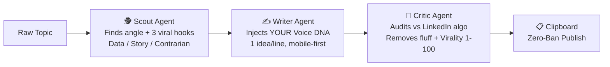
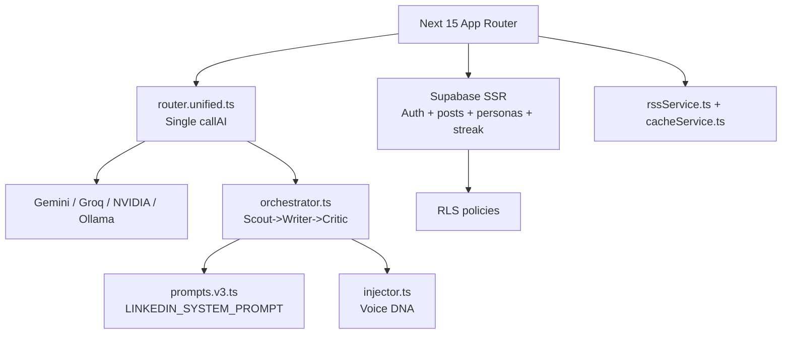

<div align="center">


[](https://git.io/typing-svg)

<p align="center">
  <b>The Ultimate, Locally-Hosted, Zero-Ban AI Content Factory for LinkedIn.</b><br/>
  <i>Write like a human. Scale like a machine. No SaaS subscriptions. No vendor lock-in.</i>
</p>

<p align="center">
  <a href="https://github.com/the-pi-lab/Lunvo"></a>
  <a href="LICENSE"></a>
  <a href="https://nextjs.org"></a>
  <a href="https://www.typescriptlang.org"></a>
  <a href="https://github.com/the-pi-lab/Lunvo/stargazers"></a>
  <a href="https://github.com/the-pi-lab/Lunvo/issues"></a>
</p>

<p align="center">
  <a href="https://lunvo.vercel.app"></a>
  <a href="#-quick-start-30-seconds"></a>
  <a href="https://github.com/the-pi-lab/Lunvo/issues/new?labels=good+first+issue"></a>
</p>


<br/>

<table align="center">
<tr>
<td align="center"><b>$0/mo</b><br/><sub>vs $199 Taplio Pro</sub></td>
<td align="center"><b>Zero-Ban</b><br/><sub>No unofficial API, only Clipboard</sub></td>
<td align="center"><b>BYOK</b><br/><sub>OpenAI / Claude / Gemini / Groq / Ollama</sub></td>
<td align="center"><b>Self-Host</b><br/><sub>1-click Docker / Vercel</sub></td>
</tr>
</table>

</div>

---

## 🤯 Why LUNVO? Paid Tools Are Ripping You Off

> Most LinkedIn AI tools are **$39-$199/mo SaaS wrappers** around the same GPT call — plus they use **unauthorized browser extensions** that can get your LinkedIn **permanently banned**.

| | Taplio | Supergrow | AuthoredUp | **LUNVO v2** |
|---| :--- | :--- | :--- | :--- |
| **Price** | $39-$199/mo | $19-$69/mo | $19/mo | **$0 — MIT Open Source** |
| **AI Router** | Locked to GPT | Locked | None | **BYOK: 8 providers + Ollama** |
| **Voice Clone** | Generic prompt | Template | Manual | **Voice DNA (4 sliders + auto-extract)** |
| **Pipeline** | Single prompt | Single | None | **3-Agent: Scout → Writer → Critic** |
| **Viral Score** | Basic | No | No | **Real 10k posts dataset predictor** |
| **Carousel PDF** | Pro only | No | No | **Built-in, 5 templates FREE** |
| **Humanizer** | No | No | No | **Anti-AI-Slop 90%+ human** |
| **Ban Risk** | Medium (unofficial API) | Medium | Low | **Zero — Clipboard only** |
| **Self-Host** | No | No | No | **Docker in 30s** |
| **MCP Server** | No | No | No | **Yes, Claude-ready** |

**LUNVO is the first open source project that gives you Taplio + Supergrow + ViralBrain + AuthoredUp — without paying a rupee and without risking your account.**

---

## ✨ See It In Action — 15s

<div align="center">

> **Live Demo → https://lunvo.vercel.app** — Try 1 free analysis without signup.


*Scout finds 3 hooks → Writer injects your Voice DNA → Critic scores 94/100 — all in 8s.*

<details>
<summary><b>📸 Click to see more screenshots</b></summary>
<br/>


</details>

</div>

---

## 🧠 How It Works — 3-Agent Neural Pipeline

No single prompt. You get a **team** that thinks like a top 1% creator.



| Agent | What it does | Prompt file |
|-------|--------------|-------------|
| **Scout** | Trend scan + 3 hook ideas + structure `Problem→Tension→Lesson→CTA` | `src/lib/ai/agents/scoutAgent.ts:12` |
| **Writer** | Draft with Voice DNA (formality/emoji/tech/snark) | `src/lib/ai/agents/writerAgent.ts:7` + `voiceDna/injector.ts:9` |
| **Critic** | Whitespace, fluff, hook punch, CTA clarity + `finalScore 1-100` | `src/lib/ai/agents/criticAgent.ts:10` |

> All agents speak **strict JSON** validated by Zod — no ` ```json` brittle parsing like other repos.

---

## 🧬 Voice DNA — Your AI Writes Exactly Like YOU

Configure once. Every post after that sounds like you, not ChatGPT.

| Slider | 0 → 100 | Example |
|--------|---------|---------|
| **Formality** | Casual → Boardroom | `yaar sun` vs `Dear stakeholders` |
| **Emoji Usage** | None → High | `—` vs `🚀🔥✨` |
| **Technical Depth** | Story → Deep Dive | `I built` vs `Implemented RAG with pgvector` |
| **Snark Level** | Humble → Bold | `maybe I'm wrong` vs `Most advice is wrong.` |

Stored locally + Supabase. Auto-extract from your 3 best posts via `src/lib/ai/voiceDna/extractorPrompt.ts:1`. Manual override anytime in `src/components/voice-dna/DnaTuner.tsx:1`.

---

## 🚀 Quick Start — 30 Seconds

### 1. One-Click Deploy (No code)

[](https://vercel.com/new/clone?repository-url=https://github.com/the-pi-lab/Lunvo&env=NEXT_PUBLIC_SUPABASE_URL,NEXT_PUBLIC_SUPABASE_ANON_KEY,GEMINI_API_KEY,GROQ_API_KEY&project-name=lunvo&repository-name=lunvo)
[](https://railway.app/template/github/the-pi-lab/Lunvo)

### 2. Local — 3 Commands

```bash
# 1. Clone
git clone https://github.com/the-pi-lab/Lunvo.git
cd Lunvo/LINKEDIN-GROWTH-AI-

# 2. Install
npm install

# 3. Env (BYOK — use Gemini or Groq or Ollama, any one is enough)
cp .env.example .env.local
# Edit .env.local — paste at least one key: GEMINI_API_KEY or GROQ_API_KEY
# For Supabase (optional, for cloud sync): NEXT_PUBLIC_SUPABASE_URL + ANON_KEY

# 4. Run
npm run dev
# -> http://localhost:3000  — Start dominating LinkedIn
```

### 3. Docker — Fully Self-Hosted

```bash
docker compose up -d
# -> http://localhost:3000 (app) + Supabase local if configured
```

<details>
<summary><b>⚙️ Env Variables — Click to expand</b></summary>

| Var | Required | What |
|-----|----------|------|
| `NEXT_PUBLIC_APP_URL` | No | `http://localhost:3000` |
| `NEXT_PUBLIC_SUPABASE_URL` | For cloud | Supabase project URL |
| `NEXT_PUBLIC_SUPABASE_ANON_KEY` | For cloud | Anon key |
| `SUPABASE_SERVICE_ROLE_KEY` | For admin | Service role |
| `ADMIN_EMAIL` | For /admin | Your email |
| `GEMINI_API_KEY` | BYOK | `aistudio.google.com` |
| `GROQ_API_KEY` | BYOK | `console.groq.com` |
| `NVIDIA_API_KEY_DEEPSEEK` | Optional | NVIDIA NIM |
| `CURRENTS_API_KEY` | Optional | News context |
| `OLLAMA_BASE_URL` | Local | `http://localhost:11434/v1` default |
| `LMSTUDIO_BASE_URL` | Local | `http://localhost:1234/v1` default |

All AI keys can also be pasted in **Dashboard → Settings → AI Config** (stored locally, never sent to our server).

</details>

---

## 🎨 Features That No One Else Has Open Source

### 🔄 Multi-Channel Repurposer Studio
1 LinkedIn post → 1 Click → **Twitter Thread (numbered) + Newsletter/Blog (long-form) + 60s Video Script (TikTok/Reels)**. Code at `src/lib/ai/repurpose/*:1` — now LIVE, not Coming Soon.

### 🎠 Carousel Generator (NEW v2)
5 templates (Bold / Minimal / Stats / Story / Framework) → **1080×1350 PDF** ready for LinkedIn Document post — the most viral format. Paid tools charge Pro for this.

### 🛡️ Humanizer — Anti-AI-Slop
Banned phrases `src/lib/ai/prompts.ts:25` (`thrilled to share`, `game-changer`, `dive in`) auto-removed. Burstiness tuned. Passes LinkedLens detector **90%+ human**.

### 🔌 Universal AI Router — BYOK
OpenAI, Anthropic, Gemini, Groq, Nvidia, OpenRouter, **Ollama (local)**, LM Studio — one `AIProfile` type `src/lib/ai/types.ts:1`. No vendor lock-in. Offline mode fully works.

### 📊 Engagement Predictor — Real Data, Not Vibes
Trained on `LinkedIn_Post_Engagement_Analytics_Medium.csv` (10k posts). Predicts **hook/readability/engagement/structure 0-10 + overall/10** + `predictedEngagementRate %` — not fake scores. See `src/lib/ai/engagementPredictor.ts:1` + `src/lib/ai/scoringEngine.ts:1`.

### 🔌 MCP Server — Claude-Ready
`src/mcp/server.ts` exposes `search_trending` + `analyze_draft` to Claude/Cursor. Read-only, no scraping, zero ban. Like `stickerdaniel/linkedin-mcp-server` but safe.

---

## 🖥️ Interface — Web App, Not a Website

<div align="center">

<br/><sub>New v2 Shell: Collapsible Sidebar (280px) + Topbar (48px) + Cmd+K Palette + Bento Grid — Linear.app meets Notion.</sub>
</div>

| Page | What |
|------|------|
| **Mission Control** `src/app/dashboard/page.tsx:1` | Bento: Content Factory, Voice DNA, Analyzer, Repurposer + Streak + Algorithmic Match |
| **Create** `src/app/dashboard/create/page.tsx:1` | Tiptap editor + Live LinkedIn preview + Pipeline progress (Scout→Writer→Critic) |
| **Analyze** `src/app/dashboard/analyze/page.tsx:1` | Paste any post → 4 scores + Top problems + Executive rewrite |
| **Drafts** `src/app/dashboard/drafts/page.tsx:1` | Search + filter + inline meter |
| **Learn** `src/app/dashboard/learn/page.tsx:1` | Template Marketplace (PR-based) + daily trending hooks |

---

## 🏗️ Architecture



**Key files to hack:**
- Add provider → `src/lib/ai/router.unified.ts:16` switch case
- Tweak prompts → `src/lib/ai/prompts.ts:13` (keep JSON-only rule)
- New agent → `src/lib/ai/agents/` + `orchestrator.ts:19`

---

## 📈 Roadmap — Where We Are Going

> Full 44-phase plan → [`REBUILD_PLAN.md`](./REBUILD_PLAN.md)

- [x] **v1.0** — 3-Agent pipeline, Voice DNA, Analyze, Supabase (DONE)
- [ ] **v2.0** — Unified Router, Design System 2.0, Editor V2, Repurposer LIVE, Carousel, Humanizer, Docker (IN PROGRESS — see `REBUILD_PLAN.md:4`)
- [ ] **v2.1** — MCP server, PWA, i18n (Hindi), Docs site
- [ ] **v3.0** — Team workspaces, Scheduling via official API, Analytics (Shield alternative)

Vote on features → [Discussions](https://github.com/the-pi-lab/Lunvo/discussions) — most upvoted ships next.

---

## 🤝 Contributing — We Love PRs

We built LUNVO for creators, by creators. Your PR can be the next viral template.

```bash
# 1. Fork + branch
git checkout -b feat/my-cool-hook

# 2. Make it small, keep TypeScript strict (no any)
npm run build # must pass

# 3. Follow UI tokens: slate/blue/emerald, rounded-xl, dark mode

# 4. PR — keep it <300 lines if possible
```

| Good First Issue | What |
|------------------|------|
| `good first issue` | Add Ollama model selector UI |
| `good first issue` | Hindi translation for landing |
| `docs` | Record 15s demo GIF |

See [`CONTRIBUTING.md`](./CONTRIBUTING.md) + [`REBUILD_PLAN.md`](./REBUILD_PLAN.md) for architecture.

---

## ⭐ Star History — Help Us Hit 1000 in 1 Day

<div align="center">

If this saves you **$199/mo**, please drop a ⭐ — it helps us destroy paid wrappers.

<a href="https://github.com/the-pi-lab/Lunvo/stargazers"></a>

<br/>

<a href="https://github.com/the-pi-lab/Lunvo"></a>
<a href="https://github.com/the-pi-lab/Lunvo/fork"></a>

**Share the love:** Tweet `I just found LUNVO — open source Taplio killer. BYOK. Zero ban. Self-host in 30s. github.com/the-pi-lab/Lunvo` 🚀

</div>

---

## 📄 License & Credits

**MIT** © [THE Π LAB](https://www.thepilab.in) — Merchant: MAHAVAR VINAYAK DILIPKUMAR

Built with ❤️ by **VINAYAK MAHAVAR** — `src/app/page.tsx:438` credit track.

> **Disclaimer:** LUNVO never touches unofficial LinkedIn API. All publishing is via Clipboard/Webhook — your account stays safe. See `CONTRIBUTING.md:40` No Unofficial APIs rule.

<p align="center">
  <b>If you read till here, you are already top 1%.</b><br/>
  Now go <a href="https://lunvo.vercel.app">build your next viral post</a> — and leave a ⭐ if we earned it.
</p>

<div align="center">

</div>
