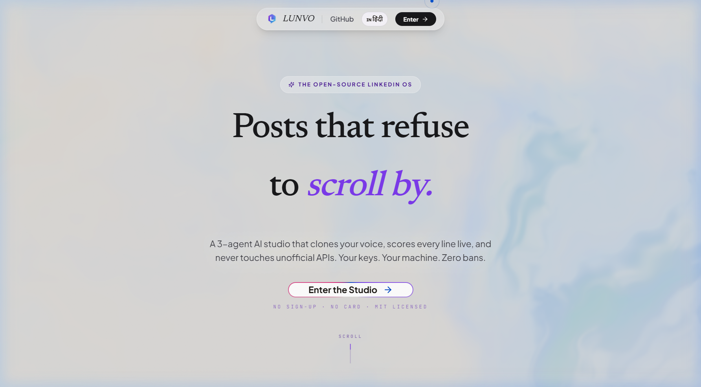
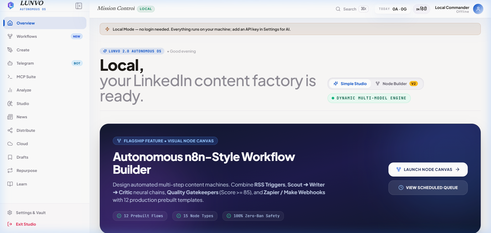
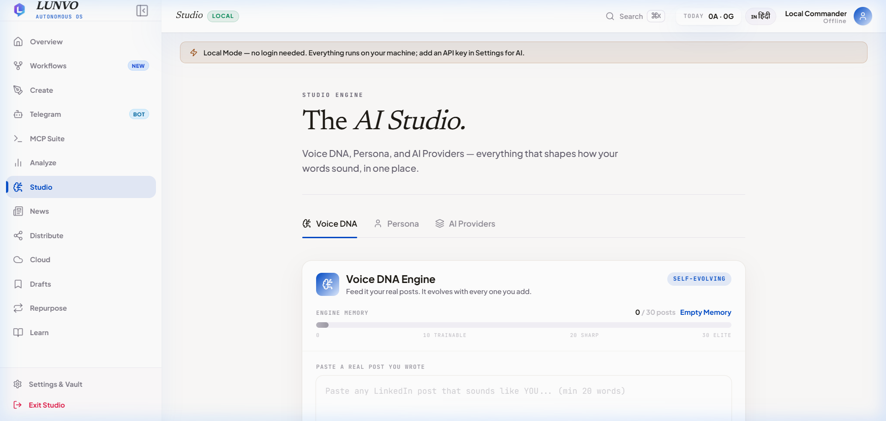
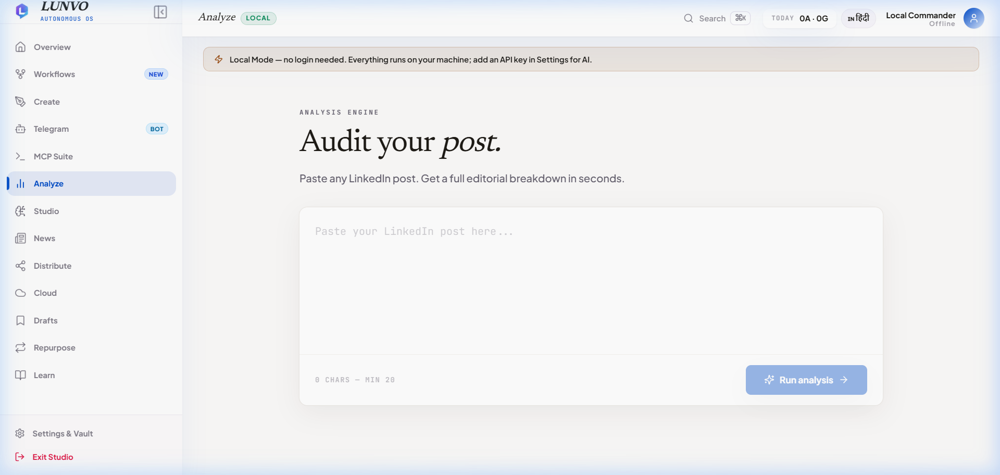
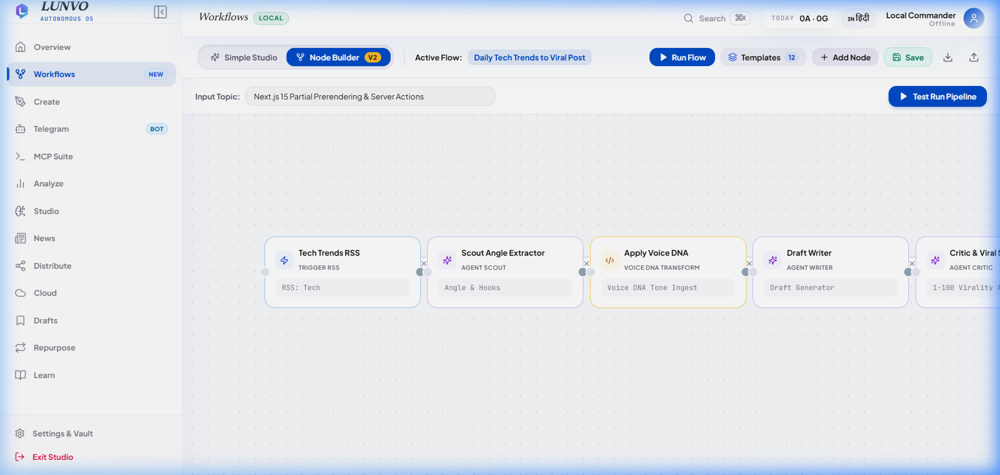
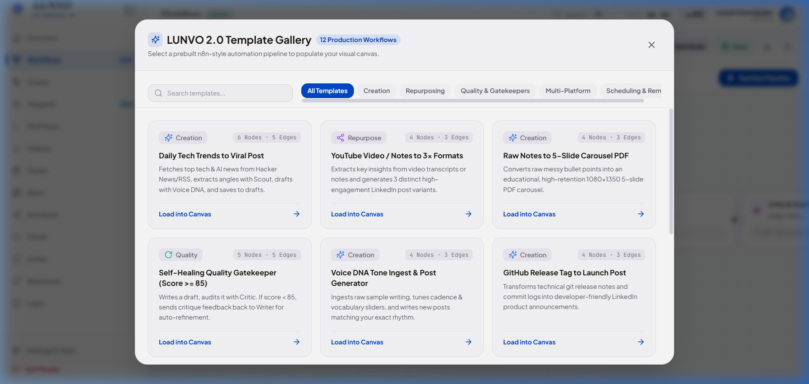
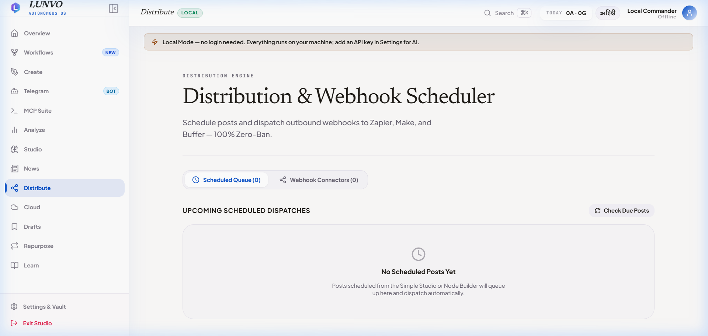
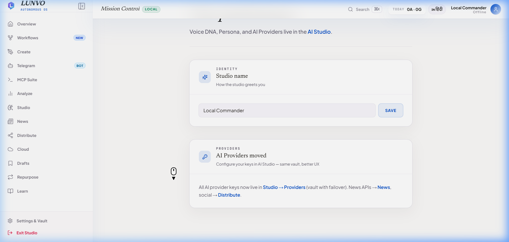
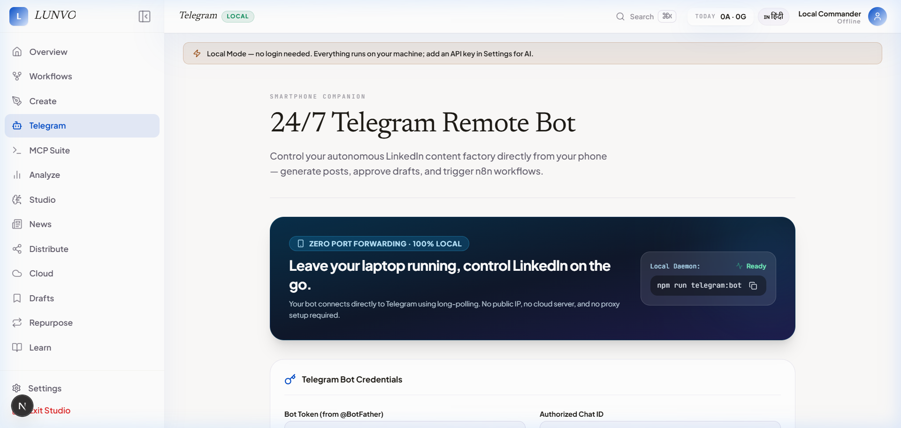
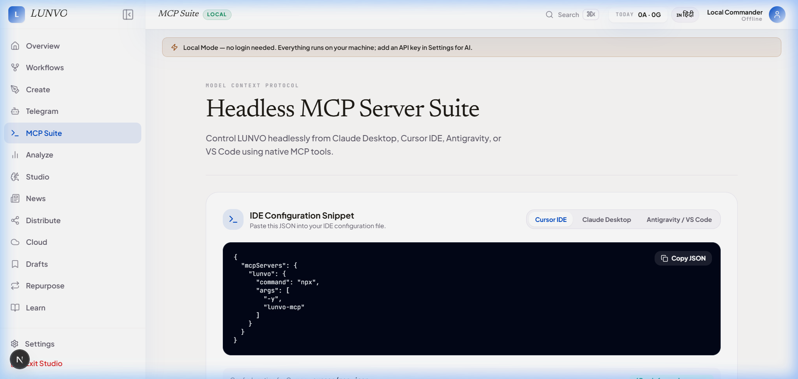

<div align="center">


[+%2B+टेलीग्राम+बॉट.;100%25+फ्री+और+सेल्फ-होस्टेड.+जीरो-बैन+गारंटी.>)](https://git.io/typing-svg)

<p align="center">
  <b>दुनिया का पहला ऑटोनॉमस, लोकली-होस्टेड AI कंटेंट ऑपरेटिंग सिस्टम लिंक्डइन के लिए।</b><br/>
  <i>विजुअल नोड ऑटोमेशन। रियल वेबहूक शेड्यूलिंग। 24/7 टेलीग्राम रिमोट बॉट। 100% ओपन सोर्स।</i>
</p>

[English README](./README.md) | [हिंदी README](./README_hi.md)

</div>

---

## 🤯 LUNVO 2.0 क्यों? Paid Tools लूट रहे हैं

| फीचर                  | Taplio          | Supergrow     | **LUNVO 2.0 (Open Source)**                         |
| :-------------------- | :-------------- | :------------ | :-------------------------------------------------- |
| **कीमत**              | $39-$199/mo     | $19-$69/mo    | **₹0 — MIT Open Source**                            |
| **नोड ऑटोमेशन**       | ❌ None         | ❌ None       | **✅ n8n-स्टाइल विजुअल नोड बिल्डर (12 टेम्पलेट्स)** |
| **रियल शेड्यूलिंग**   | Risky Scraper   | Risky Scraper | **✅ आउटबाउंड वेबहूक्स (Zapier / Make / Buffer)**   |
| **फोन रिमोट कंट्रोल** | ❌ None         | ❌ None       | **✅ 24/7 टेलीग्राम बॉट (`/idea`, `/approve`)**     |
| **AI Router**         | Locked GPT      | Locked        | **✅ BYOK: 8 Providers + लोकल Ollama / LMStudio**   |
| **Voice DNA**         | Generic         | Template      | **✅ 4 पैरामीट्रिक स्लाइडर + ऑटो-एक्सट्रैक्ट**      |
| **Carousel PDF**      | Pro only        | No            | **✅ 5 टेम्पलेट्स, 1080×1350 PDF फ्री**             |
| **Humanizer**         | No              | No            | **✅ Anti-AI Slop (90%+ Human Score)**              |
| **MCP Server**        | No              | No            | **✅ `npx lunvo-mcp` (Cursor / Claude Desktop)**    |
| **बैन रिस्क**         | High (Scrapers) | High          | **✅ Zero Ban Guaranteed**                          |

## 🎥 लाइव मोशन डेमो और स्क्रीनशॉट्स

<div align="center">

<a href="https://lunvo-tawny.vercel.app/"></a>

_Scout 3 वायरल हुक्स निकालता है → Writer आपकी Voice DNA के साथ वर्ड-बाय-वर्ड स्ट्रीम करता है → Critic 94/100 स्कोर देता है → विजुअल नोड ऑटोमेशन पूरा पाइपलाइन चलाता है।_

</div>

<details open>
<summary><b>📸 UI और फीचर्स गैलरी — लाइव प्रोडक्शन से (क्लिक करें)</b></summary>
<br/>

### 1. आधुनिक लैंडिंग पेज और अतीलिए हीरो
लिंक्डइन OS का मुख्य प्रवेश द्वार — लाइव इंटरएक्टिव प्रीव्यू और तत्काल एक्सेस।



### 2. मिशन कंट्रोल — डैशबोर्ड बेंटो ग्रिड
ग्रोथ स्ट्रीक, क्विक एक्शन्स, और कंटेंट हेल्थ का एक ही स्क्रीन पर विस्तृत दृश्य।



### 3. कंटेंट क्रिएशन स्टूडियो और Tiptap AI एडिटर
स्लैश कमांड्स (`/hook`, `/cta`), Voice DNA और लाइव लिंक्डइन मोबाइल प्रीव्यू के साथ।



### 4. पोस्ट एनालाइजर और 100-पॉइंट वायरल मीटर
हुक इम्पैक्ट, मोबाइल रीडेबिलिटी और Anti-AI ह्यूमन स्कोर का तत्काल ऑडिट।



### 5. n8n-स्टाइल 2D विजुअल वर्कफ़्लो ऑटोमेशन कैनवास
पैन, ज़ूम (30% से 200%), नोड वायरिंग और लाइव पाइपलाइन एग्जीक्यूशन।



### 6. प्रोडक्शन वर्कफ़्लो टेम्पलेट्स गैलरी
12 प्रीबिल्ट ऑटोमेशन टेम्पलेट्स — RSS News to Post, YouTube Repurposer, Carousel PDF, Quality Gatekeeper.



### 7. सुरक्षित आउटबाउंड वेबहूक शेड्यूलर और क्यू मैनेजर
Zapier, Make, और Buffer के जरिए बिना बैन रिस्क के ऑटो-शेड्यूलिंग।



### 8. 54+ AI प्रोवाइडर वॉल्ट और सेटिंग्स
Frontier, Groq, Cerebras और ऑफलाइन Ollama के लिए क्लाइंट-साइड सिक्योर की स्टोरेज।



### 9. 24/7 टेलीग्राम रिमोट बॉट और मोबाइल फोन कंट्रोल्स
फोन से बैठे-बैठे `/idea`, `/humanize`, और `/approve` के जरिए पोस्ट शेड्यूल करें।



### 10. हेडलेस Model Context Protocol (MCP) सर्वर
Claude Desktop, Cursor और Antigravity IDE के लिए 8 टूल्स (`npx lunvo-mcp`).



</details>

---

## ✨ मुख्य फीचर्स (LUNVO 2.0)

1. ⚡ **n8n-स्टाइल विजुअल नोड बिल्डर**: 12 प्रीबिल्ट टेम्पलेट्स (Daily RSS to Post, YouTube Repurposer, Carousel PDF, Quality Gatekeeper).
2. 🌐 **रियल वेबहूक शेड्यूलर**: Zapier / Make / Buffer के जरिए बिना किसी लिंक्डइन पासवर्ड या कुकी के सुरक्षित ऑटो-पोस्टिंग।
3. 📱 **24/7 टेलीग्राम रिमोट बॉट**: अपने फोन से टेलीग्राम पर बैठे-बैठे पोस्ट जनरेट और अप्रूव करें।
4. 🔌 **हेडलेस MCP सर्वर**: किसी भी IDE (Cursor, Claude, Antigravity) से LUNVO को बैकग्राउंड में चलाएं (`npx lunvo-mcp`).

---

## 🚀 30 सेकंड में शुरू करें

```bash
git clone https://github.com/the-pi-lab/Lunvo.git
cd Lunvo
npm install
cp .env.example .env.local  # GEMINI_API_KEY या GROQ_API_KEY डालें
npm run dev # http://localhost:3000
```

**Docker:**

```bash
chmod +x setup.sh && ./setup.sh
# → http://localhost:3000
```

**भाषा:** ऊपर `EN | हिंदी` टॉगल या `/hi/dashboard` — `next-intl` से।

---

## 🎨 नई फीचर्स (Phases 18-39)

- **Image Studio (6 प्रो स्टाइल)** — Minimal, Corporate, Data, Quote, Photo, Carousel — Relevancy vs Prompt
- **News Connectors (8 APIs)** — Currents, NewsAPI, GNews, Mediastack, NewsData, TheNewsAPI, WorldNews, Bing
- **Distribution (BYOC)** — Zapier, Twitter, Reddit webhook — `Copy → LinkedIn 1 tap` + `navigator.share` + `.ics`
- **Cloud (BYOC)** — Supabase, Convex, Firebase, Turso, PlanetScale — local-first, optional
- **Tiptap Editor** — `/hook` `/cta` slash, `normalizePostText` paste
- **Voice DNA Tuner V2** — 4 sliders + auto-fill + `isHumanScore`
- **MCP Server** — `npx lunvo-mcp` → `search_trending` + `analyze_draft` Claude में

---

## 📄 लाइसेंस एवं कंपनी
 
**MIT** © [THE Π LAB](https://www.thepilab.in) — **VINAYAK MAHAVAR**
- **कंपनी लिंक्डइन:** [THE Π LAB on LinkedIn](https://www.linkedin.com/company/the-%CF%80-lab/)
- **लाइव प्रोडक्शन:** [https://lunvo-tawny.vercel.app/](https://lunvo-tawny.vercel.app/)
